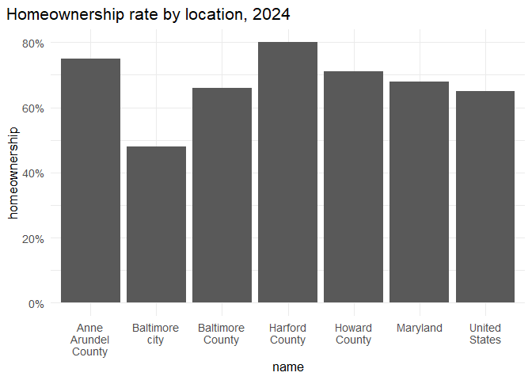
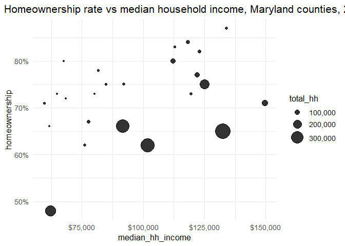
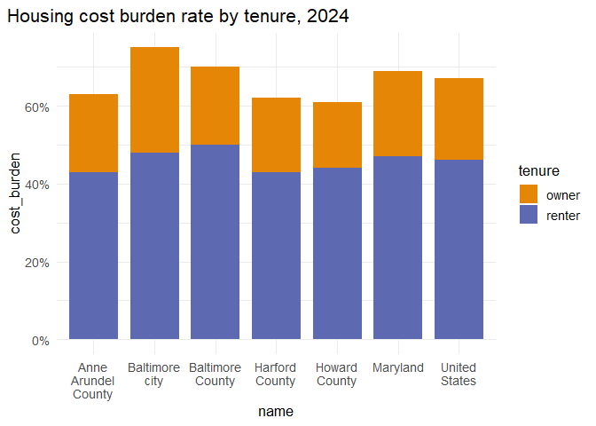

# Visual encodings


In this lab, we’ll practice properly mapping data onto visual encodings.
First, you’ll take notes on the encodings used in several charts. Then
you’ll edit code to improve or correct some encodings.

Some references to use with this lab:

- Wilke’s book, chapters
  [2](https://clauswilke.com/dataviz/aesthetic-mapping.html) and
  [17](https://clauswilke.com/dataviz/proportional-ink.html)
- Munzner’s chart of visual encoding rankings [on the course notes
  site](https://umbc-viz.github.io/ges778/extras/encodings.html)
- The [ggplot2 documentation](https://ggplot2.tidyverse.org)

## Identifying encodings

For each chart, jot down the following:

- Type of chart
- All major encodings (x- and y-axes, size, color, shape, etc.)
- What encoding your brain *primarily* reads to understand the data
  (lightness, position, length, etc.)
- What pattern is highlighted by this type of chart (distribution,
  absolute amounts, relative amounts, etc.)
- Any markings that guide you in reading the chart
- Anything that is not essential to understanding the chart (i.e. “chart
  junk”)

### Chart 1


type: bar chart (vertical) encodings: x = name of location, y =
homeownership rate (%) primary reading: length of bars patterns: ranking
of the same variable across different locations markings: gridlines at
intervals of 20% other: pretty self-explanatory, I dont see any chart
junk

### Chart 2

 type: bar chart (horizontal)
encodings: x = homeowndership rate (%), y = location name primary
reading: length of the bars patterns: same as above, just flipped axes
markings: gridlines at each interval of 20% other: same as above, no
chart junk

### Chart 3

 type: dot plot encodings: y = location
name, x = homeownership rate in % primary reading: position along the x
axis patterns: ranking the same variable (homeownership rate) but at
different locations markings: gridlines every 10% other: none

### Chart 4

 type: box and whisker plot encodings: y =
location (county), x = homeowndership rate (%) primary reading: median
line, 1st and 3rd quartile lines, position of box along x patterns:
different spread median and bottom limit of range within each county,
even though the IQRs of most of them lie at similar x values markings:
gridlines at each 12.5%, outlier dots, whiskers other:

### Chart 5

 type: two series line graph encodings: x =
year (i think quarterly/continuous?), y = unemployment rate (%) primary
reading: slope of line, peaks patterns: comparing the trends between two
differejnt locations over time\
markings: gridlines every 2 years, legend showing what color is which
city other: none

### Chart 6


type: area chart encodings: x = year (quarterly/continuous?), y =
unemployment rate (%) patterns: slope, peaks markings: trends over time
other: none

### Chart 7


type: scatter plot encodings: x = median household income (\$), y =
homeownership rate (%) patterns: coorelation between 2 variables (median
hh income and homeownership rate) markings: size of dot, color of dot,
gridlines every \$12500 and 10%, legend showing what colors and sizes
mean other: none

## Correcting encodings

For each of these charts, write down what is wrong with the encodings.
Then edit the code to correct it.

``` r
library(dplyr)
```

    Warning: package 'dplyr' was built under R version 4.5.3

    Attaching package: 'dplyr'

    The following objects are masked from 'package:stats':

        filter, lag

    The following objects are masked from 'package:base':

        intersect, setdiff, setequal, union

``` r
library(ggplot2)
```

    Warning: package 'ggplot2' was built under R version 4.5.3

``` r
# set a default theme
theme_set(
    theme_minimal(base_size = 13) + theme(plot.title.position = "plot")
)

# pull a carto color palette
qual_pal <- rcartocolor::carto_pal(name = "Vivid")

# for convenience, filter just main locations
acs_balt <- justviz::acs |>
    filter(
        name %in%
            c(
                "United States",
                "Maryland",
                "Baltimore city",
                "Baltimore County",
                "Anne Arundel County",
                "Harford County",
                "Howard County"
            )
    )
```

### Chart 8


makes baltimore city difference look more extreme than it is in reality

``` r
# Hint: ggplot has some guardrails to keep you from making bad charts
# I needed to add a dummy variable to get around that
acs_balt |>
    mutate(datasource = "acs") |>
    ggplot(aes(x = name, y = homeownership, group = datasource)) +
    geom_col() +
    scale_x_discrete(labels = scales::label_wrap(10)) +
    scale_y_continuous(labels = scales::label_percent()) +
    labs(title = "Homeownership rate by location, 2024")
```



### Chart 9


``` r
# Hint: compare to chart 7
justviz::acs |>
    filter(level == "county") |>
    ggplot(aes(x = median_hh_income, 
               y = homeownership, 
               size = total_hh,)) +
    geom_point(alpha = 0.8) +
    scale_radius(labels = scales::label_comma(), range = c(1, 10)) +
    scale_x_continuous(labels = scales::label_currency()) +
    scale_y_continuous(labels = scales::label_percent()) +
    labs(
        title = "Homeownership rate vs median household income, Maryland counties, 2024"
    )
```



### Chart 10


*Fill in notes here*

``` r
# reshape data to use color
# someone please remind Camille to go over this
cost_burden <- acs_balt |>
    select(name, owner_cost_burden, renter_cost_burden) |>
    tidyr::pivot_longer(
        -name,
        names_to = c("tenure", ".value"),
        names_pattern = "(^[a-z]+)_(\\w+$)",
        names_ptypes = list(tenure = factor())
    )

ggplot(cost_burden, aes(x = name, y = cost_burden, fill = tenure)) +
    geom_col(width = 0.8, position = position_stack()) +
    scale_fill_manual(values = qual_pal[c(1, 2)]) +
    scale_x_discrete(labels = scales::label_wrap(10)) +
    scale_y_continuous(labels = scales::label_percent()) +
    labs(title = "Housing cost burden rate by tenure, 2024")
```


