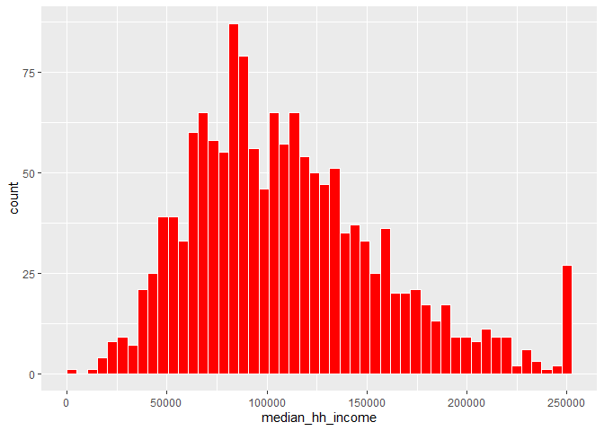
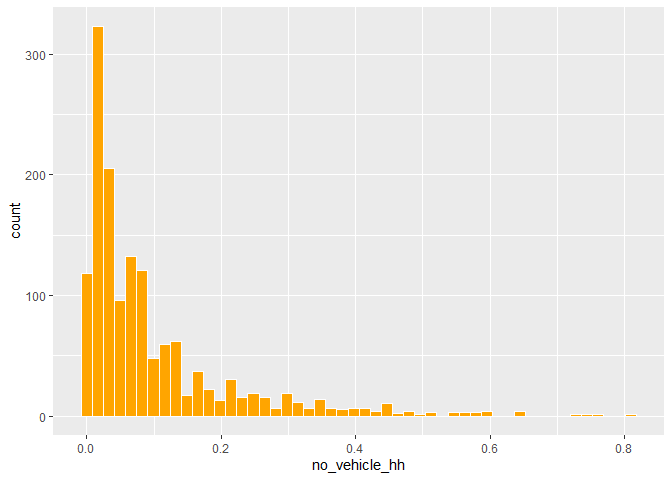
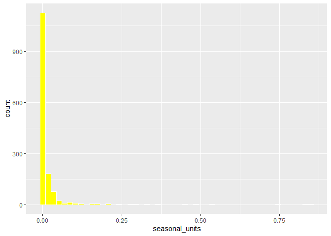
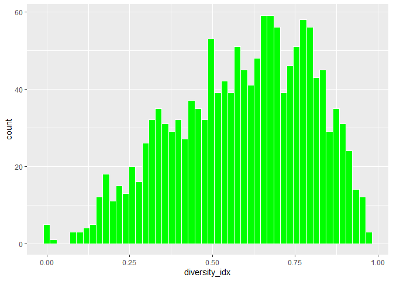
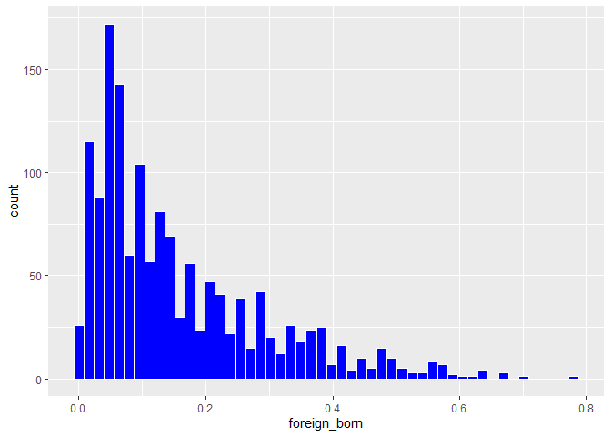
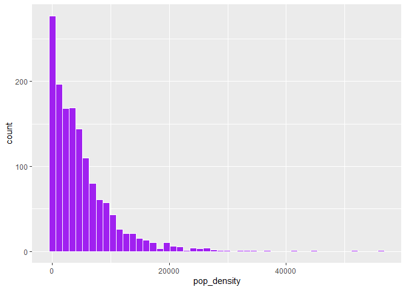

# Exploratory data visualization


For this lab, you’ll do some EDV with the ACS data, taking similar steps
to what I did in the EDV course notes. Start with a subset of just data
for tracts, and some variables you’ll explore. Choose at least 6 numeric
variables, plus keep county and name. (Don’t use ages 25+, poverty
status determined, or total housing units; those are all just there as
denominators.)

``` r
library(ggplot2)
```

    Warning: package 'ggplot2' was built under R version 4.5.3

``` r
acs_tracts <- justviz::acs |>
    dplyr::filter(level == "tract") |>
    dplyr::select(county, 
                  name, 
                  median_hh_income, 
                  no_vehicle_hh,
                  seasonal_units,
                  diversity_idx,
                  foreign_born,
                  pop_density) # replace NULL with the columns you want to use
head(acs_tracts)
```

    # A tibble: 6 × 8
      county       name  median_hh_income no_vehicle_hh seasonal_units diversity_idx
      <chr>        <chr>            <dbl>         <dbl>          <dbl>         <dbl>
    1 Allegany Co… 2400…            63415          0.03           0.17         0.110
    2 Allegany Co… 2400…            67724          0.05           0.07         0.485
    3 Allegany Co… 2400…            34545          0.23           0            0.513
    4 Allegany Co… 2400…            52250          0.1            0            0.332
    5 Allegany Co… 2400…            36673          0.18           0            0.315
    6 Allegany Co… 2400…            28056          0.21           0            0.376
    # ℹ 2 more variables: foreign_born <dbl>, pop_density <dbl>

Look at the first few rows of data, and print a summary. Jot down
anything that seems noteworthy—missing values, very high or low values,
etc.

``` r
 summary(acs_tracts)
```

        county              name           median_hh_income no_vehicle_hh    
     Length:1460        Length:1460        Min.   :  2499   Min.   :0.00000  
     Class :character   Class :character   1st Qu.: 74966   1st Qu.:0.02000  
     Mode  :character   Mode  :character   Median :103192   Median :0.05000  
                                           Mean   :110249   Mean   :0.09591  
                                           3rd Qu.:137163   3rd Qu.:0.12000  
                                           Max.   :250001   Max.   :0.81000  
                                           NA's   :8        NA's   :4        
     seasonal_units    diversity_idx     foreign_born     pop_density       
     Min.   :0.00000   Min.   :0.0000   Min.   :0.0000   Min.   :    0.419  
     1st Qu.:0.00000   1st Qu.:0.4388   1st Qu.:0.0500   1st Qu.: 1006.389  
     Median :0.00000   Median :0.6167   Median :0.1100   Median : 3455.259  
     Mean   :0.01145   Mean   :0.5907   Mean   :0.1557   Mean   : 4958.910  
     3rd Qu.:0.00000   3rd Qu.:0.7586   3rd Qu.:0.2300   3rd Qu.: 6796.855  
     Max.   :0.85000   Max.   :0.9728   Max.   :0.7800   Max.   :56280.606  
     NA's   :4                                                              

## Variation

For each numeric variable in your data, make a histogram. Adjust the
number of bins or the binwidths for each one until you find something
easy to read and that shows the data well. Again, jot down what you
notice about the distributions.

``` r
 ggplot(acs_tracts, aes(x = median_hh_income)) +
    geom_histogram(bins = 50, 
                   color = "white",
                   fill = "red")
```

    Warning: Removed 8 rows containing non-finite outside the scale range
    (`stat_bin()`).



``` r
 ggplot(acs_tracts, aes(x = no_vehicle_hh)) +
    geom_histogram(bins = 50, 
                   color = "white",
                   fill = "orange")
```

    Warning: Removed 4 rows containing non-finite outside the scale range
    (`stat_bin()`).



``` r
 ggplot(acs_tracts, aes(x = seasonal_units)) +
    geom_histogram(bins = 50, 
                   color = "white",
                   fill = "yellow")
```

    Warning: Removed 4 rows containing non-finite outside the scale range
    (`stat_bin()`).



``` r
 ggplot(acs_tracts, aes(x = diversity_idx)) +
    geom_histogram(bins = 50, 
                   color = "white",
                   fill = "green")
```



``` r
 ggplot(acs_tracts, aes(x = foreign_born)) +
    geom_histogram(bins = 50, 
                   color = "white",
                   fill = "blue")
```



``` r
 ggplot(acs_tracts, aes(x = pop_density)) +
    geom_histogram(bins = 50, 
                   color = "white",
                   fill = "purple")
```



## Unusual values

For one of your variables with a heavy skew or some extreme values,
filter the data either with `dplyr::filter` or by setting axis limits
like I did in the notes. What can you see by removing these extreme
values?

## Covariation

Next, choose one of your numeric variables and make a series of boxplots
of it by county. To do this, you can put the variable you’re studying on
the x-axis and county on the y-axis, then use `geom_boxplot`. What
patterns can you see now that were obscured by looking at all tracts in
the state lumped together?

Pick a variable you want to investigate; pretend you’re going to build a
model to predict this variable (dependent variable). Choose another
variable that you think could be a feature in your model (independent
variable), and make a scatterplot with your dependent variable on the
y-axis and your independent variable on the x-axis. If it’s too dense to
read easily, try different strategies to reduce overplotting. Repeat
this with 2 more independent variables.

Now pick one of those independent variables that you think could
potentially be used in a linear regression model. On your scatterplot,
add a regression line with `geom_smooth(method = lm)` (see [the
docs](https://ggplot2.tidyverse.org/reference/geom_smooth.html))

What does the regression line tell you?
