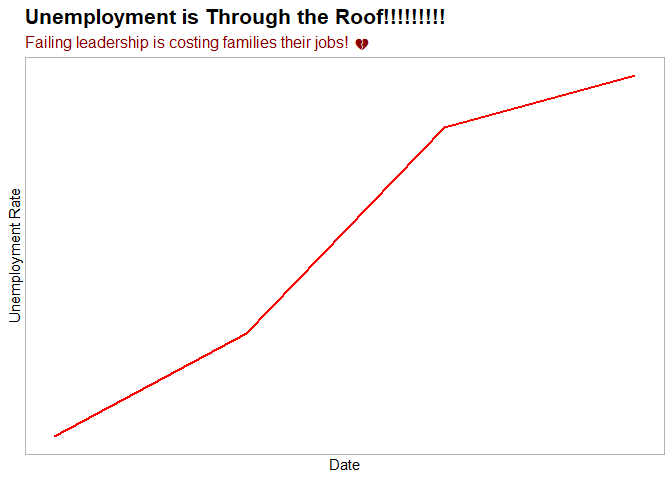
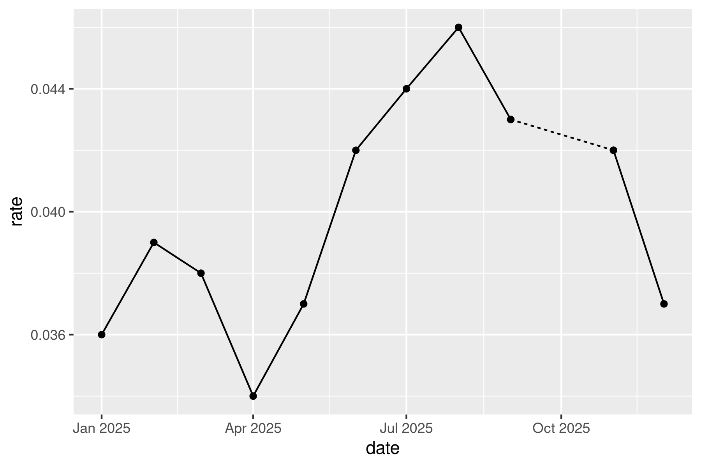
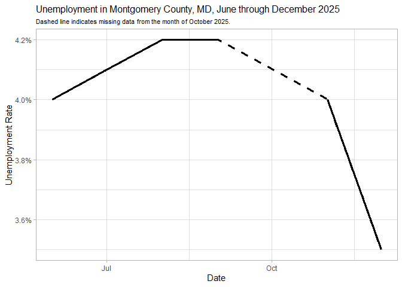
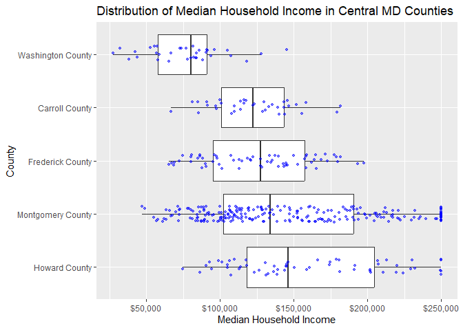
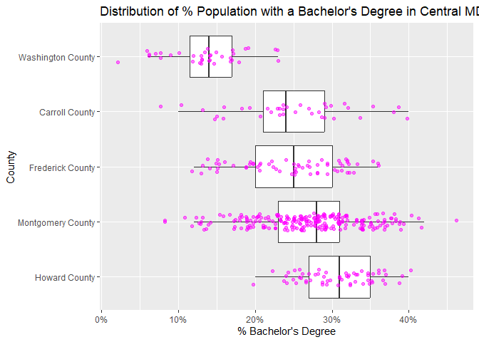

# Scope, details, and uncertainty


## Slicing & dicing trends

Imagine you’re a slimy political operative consulting on a campaign for
some office in the Maryland county of your choice. You have access to
unemployment data since the start of 2020, when the opposing candidate
took office. You want to make them look bad, so you cherrypick the data
to make it look like unemployment has only increased lately so you can
blame it on them.

Filter the data for just the county you choose. Then further filter,
summarize, or otherwise manipulate the data to make a chart that tells
the misleading story you want.

``` r
library(ggplot2)
```

    Warning: package 'ggplot2' was built under R version 4.5.3

``` r
library(justviz)
library(ggtext)
```

    Warning: package 'ggtext' was built under R version 4.5.3

``` r
unemp_since_2020 <- justviz::unemployment |>
    dplyr::filter(lubridate::year(date) >= 2020)

county_unemp <- unemp_since_2020 |>
    dplyr::filter(name == "Frederick County")
```

``` r
 misleading_unemp <- county_unemp |>
  dplyr::filter(date >= "2025-03-15", date <= "2025-07-31")

ggplot(misleading_unemp, aes(x = date, y = rate)) +
  geom_line(color = "red", linewidth = 1.0) +
  theme_light() +
  labs(
    # trying to underline
    title = "Unemployment is Through the Roof!!!!!!!!!",
    x = "Date",
    y = "Unemployment Rate",
    subtitle = "Failing leadership is costing families their jobs! 💔 "
  ) +
  theme(
    plot.title = element_markdown(face = "bold", size = 16,), 
    plot.subtitle = element_markdown(size = 12, color = "darkred"),
    axis.ticks.x = element_blank(),
    axis.ticks.y = element_blank(),
    axis.text.x = element_blank(),
    axis.text.y = element_blank(),
    panel.grid = element_blank()
        )
```



## Missing data

Now you’re back to being a responsible data visualization professional.
Filter the data again, this time for just 2025 and 1 location of your
choice (doesn’t have to be the same as above). We’re going to fill in
that gap from the government shutdown (October 2025). Use a solid line
for the recorded rates, and a dashed or dotted line where you fill in
between them.

Think of this task like a puzzle, and maybe sketch it on paper first.
You’ll probably need to add at least one new variable to your data. Some
hints:

- You want to draw a line that includes October, but only that 1
  observation is missing. You can’t draw a line with only 1 point; you
  need at least 2.
- You can identify missing data with `is.na(rate)`, which returns `TRUE`
  if a value is NA, or `FALSE` if not.
- Read the docs for `dplyr::lead` and `dplyr::lag`. If you use them, set
  `default = FALSE` (ask me about this if it doesn’t make sense, it’s
  just a curveball that gets me every time).
- You can add multiple `geom_line` calls, or you can do your
  calculations and bind your data back together, then map a variable
  across an encoding like linetype. The first of these is simpler, but
  the second is more flexible.

General idea you’re going for is like this:



``` r
montgomery_county <- unemp_since_2020 |>
      dplyr::filter(name == "Montgomery County")

filtered_data <- montgomery_county |>
  dplyr::filter(date >= "2025-06-01", date <= "2025-12-31")

ggplot(filtered_data, aes(x = date, y = rate)) + 
  geom_line(linewidth = 1.2) +
  geom_line(
    data = dplyr::filter(filtered_data, !is.na(rate)),
    linewidth = 1.2,
    linetype = "dashed"
) +
  scale_y_continuous(labels = scales::label_percent(accuracy = 0.1)) +
  theme_light() +
  labs(
    title = "Unemployment in Montgomery County, MD, June through December 2025",
    x = "Date",
    y = "Unemployment Rate",
    subtitle = "Dashed line indicates missing data from the month of October 2025."
  ) +
  theme(
    plot.title = element_markdown(size = 12),
    plot.subtitle = element_markdown(size = 8)
  )
```



## Distributions vs summaries

Pick 2 variables from the ACS data. Filter for just tracts within 5-7
counties (i.e. filter for `level == "tract"` and
`county %in% c(list of counties)`). For each variable, experiment with
different ways of showing distributions both within each group and
across them. `geom_boxplot`, `geom_density`, or even `geom_point` are
good places to start. Try calculating summary statistics in order to use
`geom_linerange`, a combination of points and paths, or similar
functions to show a range. Some interesting examples are in [Wilke’s
chapter on many
distributions](https://clauswilke.com/dataviz/boxplots-violins.html).

``` r
tracts <- justviz::acs |>
  dplyr::filter(
    level == "tract",
    county %in% c("Frederick County", "Montgomery County", "Carroll County", "Washington County", "Howard County")
  ) |>
  dplyr::select(county, name, median_hh_income, bachelors) |>
  dplyr::mutate(county = forcats::fct_reorder(county, median_hh_income, .fun = median, na.rm = TRUE)) |>
  dplyr::mutate(county = forcats::fct_rev(county))
```

    Warning: There was 1 warning in `dplyr::mutate()`.
    ℹ In argument: `county = forcats::fct_reorder(...)`.
    Caused by warning:
    ! `fct_reorder()` removing 1 missing value.
    ℹ Use `.na_rm = TRUE` to silence this message.
    ℹ Use `.na_rm = FALSE` to preserve NAs.

``` r
# boxplot of median hh income dist
ggplot(tracts, aes(x = median_hh_income, y = county)) +
  geom_boxplot(outlier.shape = NA) +
  geom_jitter(height = 0.15, size = 1, alpha = 0.5, color = "blue") +
  scale_x_continuous(labels = scales::label_dollar()) +
  labs(
    title = "Distribution of Median Household Income in Central MD Counties",
    x = "Median Household Income",
    y = "County"
  )
```

    Warning: Removed 1 row containing non-finite outside the scale range
    (`stat_boxplot()`).

    Warning: Removed 1 row containing missing values or values outside the scale range
    (`geom_point()`).



``` r
# boxplot of bachelors dist
ggplot(tracts, aes(x = bachelors, y = county)) +
  geom_boxplot(outlier.shape = NA) +
  geom_jitter(height = 0.15, alpha = 0.5, color ="magenta") +
  scale_x_continuous(labels = scales::label_percent()) +
  labs(
    title = "Distribution of % Population with a Bachelor's Degree in Central MD Counties",
    x = "% Bachelor's Degree",
    y = "County"
  )
```



``` r
# density of median hh income
ggplot(tracts, aes(x = median_hh_income)) +
  geom_density(fill = "blue", alpha = 0.5) +
  facet_wrap(~ county, ncol = 1) +
  scale_x_continuous(labels = scales::label_dollar()) +
  labs(
    title = "Distribution of Median Household Income in Central MD Counties", 
    x = "Median Household Income", 
    y = "Density"
    )
```

    Warning: Removed 1 row containing non-finite outside the scale range
    (`stat_density()`).


``` r
# density of bachelors degree
ggplot(tracts, aes(x = bachelors)) +
  geom_density(fill = "magenta", alpha = 0.5) +
  facet_wrap(~ county, ncol = 1) +
  scale_x_continuous(labels = scales::label_percent())+
  labs(
    title = "Distribution of % Population that Hold a Bachelor's Degree in Central MD Counties",
    x ="% Bachelor's Degree",
    y = "Density"
  )
```


``` r
summary_tracts <- tracts |>
  dplyr::summarize(
    dplyr::across(
      c(median_hh_income, bachelors),
      list(
        p10 = \(x) quantile(x, 0.10, na.rm = TRUE),
        p25 = \(x) quantile(x, 0.25, na.rm = TRUE),
        med = \(x) median(x, na.rm = TRUE),
        p75 = \(x) quantile(x, 0.75, na.rm = TRUE),
        p90 = \(x) quantile(x, 0.90, na.rm = TRUE)
      )
    ),
    n_tracts = dplyr::n(),
    .by = county
  )
# 10-90% to show more typical range/leave out extremes

# labels shown for legend
lab_80  <- "10th to 90th percentile"
lab_50  <- "25th to 75th percentile (middle 50% of tracts)"
lab_med <- "Median"

# median hh income
ggplot(summary_tracts, aes(y = county)) +
  geom_linerange(aes(xmin = median_hh_income_p10, xmax = median_hh_income_p90, color = lab_80), linewidth = 0.8) +
  geom_linerange(aes(xmin = median_hh_income_p25, xmax = median_hh_income_p75, color = lab_50), linewidth = 3) +
  geom_point(aes(x = median_hh_income_med, color = lab_med), shape = "|", size = 4) +
  scale_color_manual(
    name = NULL,
    breaks = c(lab_80, lab_50, lab_med),
    values = setNames(c("blue", "blue", "black"), c(lab_80, lab_50, lab_med))
  ) +
  guides(color = guide_legend(
    override.aes = list(linewidth = c(0.8, 3, NA), shape = c(NA, NA, "|"), size = c(NA, NA, 4))
  )) +
  scale_x_continuous(labels = scales::label_dollar()) +
  labs(
    title = "Distribution of Median Household Income in Central MD Counties",
    x = "Median Household Income",
    y = "County"
  ) +
  theme(legend.position = "bottom")
```


``` r
# bach degree
ggplot(summary_tracts, aes(y = county)) +
  geom_linerange(aes(xmin = bachelors_p10, xmax = bachelors_p90, color = lab_80), linewidth = 0.8) +
  geom_linerange(aes(xmin = bachelors_p25, xmax = bachelors_p75, color = lab_50), linewidth = 3) +
  geom_point(aes(x = bachelors_med, color = lab_med), shape = "|", size = 4) +
  scale_color_manual(
    name = NULL,
    breaks = c(lab_80, lab_50, lab_med),
    values = setNames(c("magenta", "magenta", "black"), c(lab_80, lab_50, lab_med))
  ) +
  guides(color = guide_legend(
    override.aes = list(linewidth = c(0.8, 3, NA), shape = c(NA, NA, "|"), size = c(NA, NA, 4))
  )) +
  scale_x_continuous(labels = scales::label_percent()) +
  labs(
    title = "Distribution of % Population with a Bachelor's Degree in Central MD Counties",
    x = "% Bachelor's Degree",
    y = "County"
  ) +
  theme(legend.position = "bottom")
```


