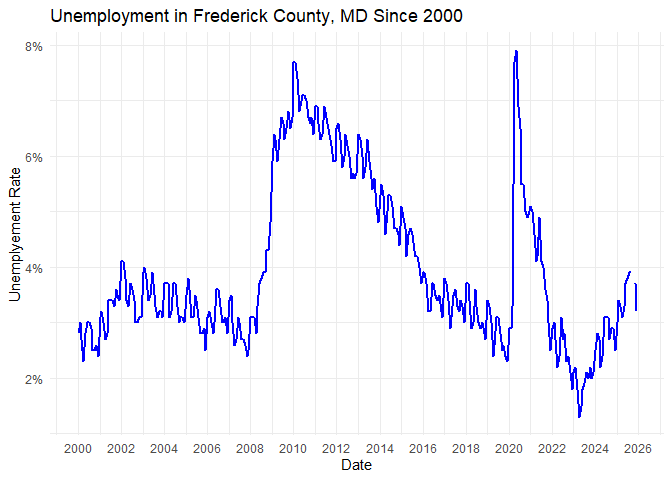
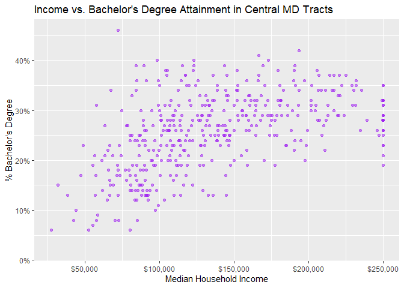
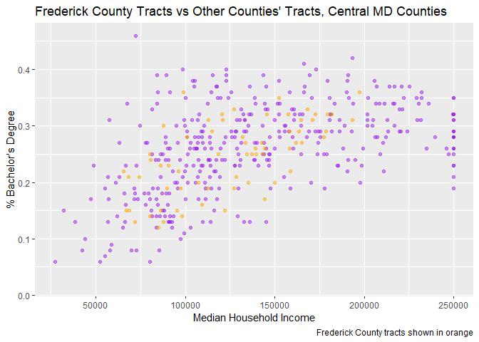

# Annotations


## Historic context

Working again with the unemployment data, filter for just one location.
Make a line chart like you’ve done already, then add annotations that
provide context. You decide what you want to show and how you want to
show it, but some ideas could be:

- Recession periods
- Presidential administrations
- COVID lockdown era
- High and low points

I already made a dataset of the same recessions FRED uses; you can get
it with `readRDS("recession_dates.rds")` if you want to work with it. If
there’s some other data you want to use and want help finding and
reading it into a data frame, let me know.

``` r
library(ggplot2)
```

    Warning: package 'ggplot2' was built under R version 4.5.3

``` r
readRDS("recession_dates.rds")
```

    # A tibble: 3 × 3
      label           peak       trough    
      <chr>           <date>     <date>    
    1 Dot-com bubble  2001-03-01 2001-11-01
    2 Great Recession 2007-12-01 2009-06-01
    3 COVID           2020-02-01 2020-04-01

``` r
fredco_unemp <- justviz::unemployment |>
  dplyr::filter(lubridate::year(date) >= 2000) |>
  dplyr::filter(name == "Frederick County")

ggplot(fredco_unemp, aes(x = date, y = rate)) +
  geom_line(color = "blue", linewidth = 0.8)  +
  scale_y_continuous(labels = scales::label_percent()) +
  scale_x_date(date_breaks = "2 years", date_labels = "%Y") +
  labs(
    title = "Unemployment in Frederick County, MD Since 2000",
    x = "Date",
    y = "Unemplyement Rate"
  ) +
  theme_minimal()
```



## Distributions pt 2

Revisit the two variables you worked with at the end of Lab 6. Make a
scatterplot of the two variables, and add annotations. Some things to
try:

- DONE Highlight certain areas or certain groups of points (geographic
  regions, values above / below some meaningful threshold, outliers).
- DONE Add lines to show averages or other benchmarks.
- DONE Add a regression line (`geom_abline` or `geom_smooth` with some
  arguments set) if it’s appropriate for the data.
- DONE Try showing the distributions of each variasble independently
  (check out `geom_rug`)

Don’t necessarily throw everything into one plot because it will be hard
to read. Make lots of plots to see what works together.

``` r
tracts <- justviz::acs |>
  dplyr::filter(
    level == "tract",
    county %in% c("Frederick County", "Montgomery County", "Carroll County", "Washington County", "Howard County")
  ) 

# regular degular scatterplot
ggplot(tracts, aes(x = median_hh_income, y = bachelors)) +
  geom_point(alpha = 0.5, color = "purple") +
  scale_x_continuous(labels = scales::label_dollar()) +
  scale_y_continuous(labels = scales::label_percent()) +
  labs(
    title = "Income vs. Bachelor's Degree Attainment in Central MD Tracts",
    x = "Median Household Income",
    y = "% Bachelor's Degree"
  )
```

    Warning: Removed 1 row containing missing values or values outside the scale range
    (`geom_point()`).



``` r
med_inc_centralmd <- median(tracts$median_hh_income, na.rm = TRUE)
med_bach_centralmd <- median(tracts$bachelors, na.rm = TRUE)

ggplot(tracts, aes(x = median_hh_income, y = bachelors)) +
  geom_point(alpha = 0.4, color = "blue") +
  geom_vline(xintercept = med_inc_centralmd, linetype = "dashed", color = "darkblue") +
  geom_hline(yintercept = med_bach_centralmd, linetype = "dashed", color = "darkblue") +
  annotate("text", x = med_inc_centralmd, y = max(tracts$bachelors, na.rm = TRUE),
           label = "Median household income", 
           hjust = -0.1,
           size = 3,
           color = "darkblue",
           fontface = "bold") +
  annotate("text", 
           x = max(tracts$median_hh_income, na.rm = TRUE), 
           y = med_bach_centralmd,
           label = "Median % bachelor's", 
           vjust = -0.5, 
           hjust = 5.2, 
           size = 3, 
           color = "darkblue",
           fontface = "bold",
           bg.color = "white",
           bg.r = 0.15) +
  scale_x_continuous(labels = scales::label_dollar()) +
  scale_y_continuous(labels = scales::label_percent()) +
  labs(
    title = "Median Household Income and Bachelor's Degree Attainment in Central MD Tracts",
    x = "Median Household Income",
    y = "% Bachelor's Degree"
  ) +
  theme_minimal()
```

    Warning in annotate("text", x = max(tracts$median_hh_income, na.rm = TRUE), :
    Ignoring unknown parameters: `bg.colour` and `bg.r`

    Warning: Removed 1 row containing missing values or values outside the scale range
    (`geom_point()`).


``` r
# highlighting
ggplot(tracts, aes(x = median_hh_income, y = bachelors)) +
  geom_point(
    alpha = 0.5, 
    data = dplyr::filter(tracts, county != "Frederick County"),
    color = "purple") +
  geom_point(
    alpha = 0.5,
    data = dplyr::filter(tracts, county == "Frederick County"),
    color = "orange"
  ) +
  labs(
    title = "Frederick County Tracts vs Other Counties' Tracts, Central MD Counties",
    x = "Median Household Income",
    y = "% Bachelor's Degree",
    caption  = "Frederick County tracts shown in orange"
  ) 
```

    Warning: Removed 1 row containing missing values or values outside the scale range
    (`geom_point()`).



``` r
ggplot(tracts, aes(x = median_hh_income, y = bachelors)) +
  geom_point(alpha = 0.3, color = "blue") +
  geom_smooth(method = "lm", color = "darkblue", se = TRUE) +
  scale_x_continuous(labels = scales::label_dollar()) +
  scale_y_continuous(labels = scales::label_percent()) +
  labs(
    title = "Income vs. Bachelor's Degree Attainment",
    x = "Median Household Income",
    y = "% Bachelor's Degree",
    caption = "Dark blue line represent the line of best fit"
  )
```

    `geom_smooth()` using formula = 'y ~ x'

    Warning: Removed 1 row containing non-finite outside the scale range
    (`stat_smooth()`).

    Warning: Removed 1 row containing missing values or values outside the scale range
    (`geom_point()`).


``` r
ggplot(tracts, aes(x = median_hh_income, y = bachelors)) +
  geom_point(alpha = 0.4, color = "purple") +
  geom_rug(alpha = 0.3, color = "purple") +
  scale_x_continuous(labels = scales::label_dollar()) +
  scale_y_continuous(labels = scales::label_percent()) +
  labs(
    title = "Median Household Income vs. Bachelor's Degree Attainment, Central MD Counties",
    x = "Median Household Income",
    y = "% Bachelor's Degree"
  )
```

    Warning: Removed 1 row containing missing values or values outside the scale range
    (`geom_point()`).

    Warning: Removed 1 row containing missing values or values outside the scale range
    (`geom_rug()`).


