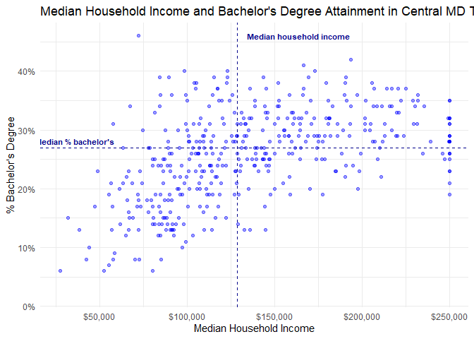
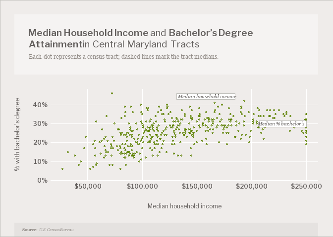

# Themes and using a styleguide


``` r
library(ggplot2)
```

    Warning: package 'ggplot2' was built under R version 4.5.3

``` r
library(ggtext)
```

    Warning: package 'ggtext' was built under R version 4.5.3

``` r
library(showtext)
```

    Warning: package 'showtext' was built under R version 4.5.3

    Loading required package: sysfonts

    Warning: package 'sysfonts' was built under R version 4.5.3

    Loading required package: showtextdb

    Warning: package 'showtextdb' was built under R version 4.5.3

Pick 2 charts of different types from previous labs. Copy & paste the
code here. Looking at the styleguide you chose last week, build color
palettes and a theme that will replicate aspects of that styleguide. You
don’t have to adhere to everything; feel free to tweak the colors or
other specifications.

I chose the sunlight style guide

``` r
tracts <- justviz::acs |>
  dplyr::filter(
    level == "tract",
    county %in% c("Frederick County", "Montgomery County", "Carroll County", "Washington County", "Howard County")
  )

## benchmarks (from annotations lab)

med_inc_centralmd <- median(tracts$median_hh_income, na.rm = TRUE)
med_bach_centralmd <- median(tracts$bachelors, na.rm = TRUE)

ggplot(tracts, aes(x = median_hh_income, y = bachelors)) +
  geom_point(alpha = 0.4, color = "blue") +
  geom_vline(xintercept = med_inc_centralmd, linetype = "dashed", color = "darkblue") +
  geom_hline(yintercept = med_bach_centralmd, linetype = "dashed", color = "darkblue") +
  annotate("text", x = med_inc_centralmd, y = max(tracts$bachelors, na.rm = TRUE),
           label = "Median household income", 
           hjust = -0.1,
           size = 3,
           color = "darkblue",
           fontface = "bold") +
  annotate("text", 
           x = max(tracts$median_hh_income, na.rm = TRUE), 
           y = med_bach_centralmd,
           label = "Median % bachelor's", 
           vjust = -0.5, 
           hjust = 5.2, 
           size = 3, 
           color = "darkblue",
           fontface = "bold",
           bg.color = "white",
           bg.r = 0.15) +
  scale_x_continuous(labels = scales::label_dollar()) +
  scale_y_continuous(labels = scales::label_percent()) +
  labs(
    title = "Median Household Income and Bachelor's Degree Attainment in Central MD Tracts",
    x = "Median Household Income",
    y = "% Bachelor's Degree"
  ) +
  theme_minimal()
```

    Warning in annotate("text", x = max(tracts$median_hh_income, na.rm = TRUE), :
    Ignoring unknown parameters: `bg.colour` and `bg.r`

    Warning: Removed 1 row containing missing values or values outside the scale range
    (`geom_point()`).



``` r
# im gonna try and make it a better habit to mark up my code with notes like this so when i come back to it after a while im not completely lost. i hope you dont mind :)

tracts <- justviz::acs |>
  dplyr::filter(
    level == "tract",
    county %in% c("Frederick County", "Montgomery County", "Carroll County", "Washington County", "Howard County")
  )

# add fonts
# georgia in windows, libre franklin is close enough hopefully
font_add_google("Libre Franklin", "franklin", regular.wt = 400, bold.wt = 600)
font_add("georgia",
         regular    = "georgia.ttf",
         bold       = "georgiab.ttf",
         italic     = "georgiai.ttf",
         bolditalic = "georgiaz.ttf")
showtext_auto()
showtext_opts(dpi = 96)

# easy colors calling
sunlight_pal <- list(
  bg = "#EFECEA",
  bg_light = "#F5F3F2",
  bg_dark = "#E5E2E0",       # added back, the caption box needs this
  text_main = "#635F5D",
  text_light = "#8E8883",
  line_white = "#FFFFFF",
  line_grey = "#C0C0BB",
  main_yellow = "#E3BA22",
  main_orange = "#E6842A",
  main_blue = "#137B80",
  main_purp = "#8E6C8A",
  money = "#5C8100"
)
# main dot color should be green b/c it represents money

med_inc_centralmd <- median(tracts$median_hh_income, na.rm = TRUE)
med_bach_centralmd <- median(tracts$bachelors, na.rm = TRUE)

# styleguide uses px as unit, ggplot uses pt and linewidth. dpi is 100 so a 650px (standard post in stylegiuide) graphic = 6.5in for easy conversions
dpi <- 100
px_pt <- function(px) px * 72 / dpi
# px -> linewidth
px_lw <- function(px) px * (96 / dpi) / .pt
# px -> size for annotate/geom_text (which is in mm)
px_mm <- function(px) px_pt(px) / .pt

# defining larger theme so i dont have to do it within the chart itself
# documentation : https://rpubs.com/mclaire19/ggplot2-custom-themes
sunlight <- function () {
  main_font = "franklin"
  sub_font = "georgia"

  theme_minimal() %+replace%
    theme(
      # backgrounds
      plot.background = element_rect(fill = sunlight_pal$bg,
                                     color = sunlight_pal$line_grey,
                                     linewidth = px_lw(1)),
      panel.background = element_rect(fill = sunlight_pal$bg,
                                      color = NA),

      # grids
      panel.grid.major = element_line(color = sunlight_pal$line_white,
                                      linewidth = px_lw(1)),
      panel.grid.minor = element_blank(),
      axis.ticks       = element_blank(),
      axis.line        = element_blank(),

      # text
      # title/headers
      # title + subtitle in ONE box bc seperately it was beoing weird
      plot.title = element_textbox_simple(family = main_font,
                                          size = px_pt(20),
                                          color = sunlight_pal$text_main,
                                          fill = sunlight_pal$bg_light,
                                          width = unit(1, "npc"),
                                          padding = margin(22, 22, 22, 22),
                                          margin = margin(0, 0, 22, 0)),
      plot.subtitle = element_blank(),
      # caption
      plot.caption = element_textbox_simple(family = sub_font,
                                            size = px_pt(8),
                                            color = sunlight_pal$text_light,
                                            fill = sunlight_pal$bg_dark,
                                            halign = 0,
                                            padding = margin(8, 12, 8, 12),
                                            margin = margin(t = 22)),
      # axes
      axis.text    = element_text(family = main_font,
                                  face = "bold",
                                  size = px_pt(12),
                                  color = sunlight_pal$text_main),
      axis.text.x  = element_text(margin = margin(t = 5)),
      axis.text.y  = element_text(margin = margin(r = 5),
                                  hjust = 1),
      axis.title   = element_text(family = main_font,
                                  size = px_pt(12),
                                  color = sunlight_pal$text_main),
      axis.title.x = element_text(margin = margin(t = 22)),
      axis.title.y = element_text(margin = margin(r = 22),
                                  angle = 90),

      plot.title.position   = "plot",
      plot.caption.position = "plot",
      plot.margin = margin(22, 22, 0, 22)
    )
}

# actual chart
ggplot(tracts, aes(x = median_hh_income, y = bachelors)) +
  geom_point(color = sunlight_pal$money, alpha = 0.7, size = 1.1) +
 # median labels
  annotate("label",
           x = med_inc_centralmd,
           y = max(tracts$bachelors, na.rm = TRUE),
           label = "Median household income",
           hjust = -0.05,
           vjust = 1,
           family = "georgia",
           fontface = "italic",
           size = px_mm(10),
           color = sunlight_pal$text_main,
           fill = "white",
           border.colour = sunlight_pal$line_grey,
           linewidth = px_lw(1),
           label.r = unit(0, "pt")) +
  annotate("label",
           x = max(tracts$median_hh_income, na.rm = TRUE),
           y = med_bach_centralmd,
           label = "Median % bachelor's",
           hjust = 1,
           vjust = -0.4,
           family = "georgia",
           fontface = "italic",
           size = px_mm(10),
           color = sunlight_pal$text_main,
           fill = "white",
           border.colour = sunlight_pal$line_grey,
           linewidth = px_lw(1),
           label.r = unit(0, "pt")) +
  scale_x_continuous(labels = scales::label_dollar()) +
  scale_y_continuous(labels = scales::label_percent(),
                     limits = c(0, NA),   # starts at 0
                     expand = expansion(mult = c(0, 0.05))) +
  labs(
  title = paste0(
      "**Median Household Income** and **Bachelor's Degree Attainment** in Central Maryland Tracts<br>",
      "<span style='font-family:georgia; font-style:italic; font-size:12px; color:#8E8883'>",
      "Each dot represents a census tract; dashed lines mark the tract medians.</span>"
    ),    
    subtitle = "Each dot represents a census tract; dashed lines mark the tract medians.",
    x        = "Median household income",
    y        = "% with bachelor's degree",
    caption  = "**Source:** *U.S. Census Bureau*"
  ) +
  sunlight()
```

    Warning: Removed 1 row containing missing values or values outside the scale range
    (`geom_point()`).



``` r
ggsave("styleguides_themedchart1.png", width = 6.5, height = 5, dpi = 96)
```

    Warning: Removed 1 row containing missing values or values outside the scale range
    (`geom_point()`).
